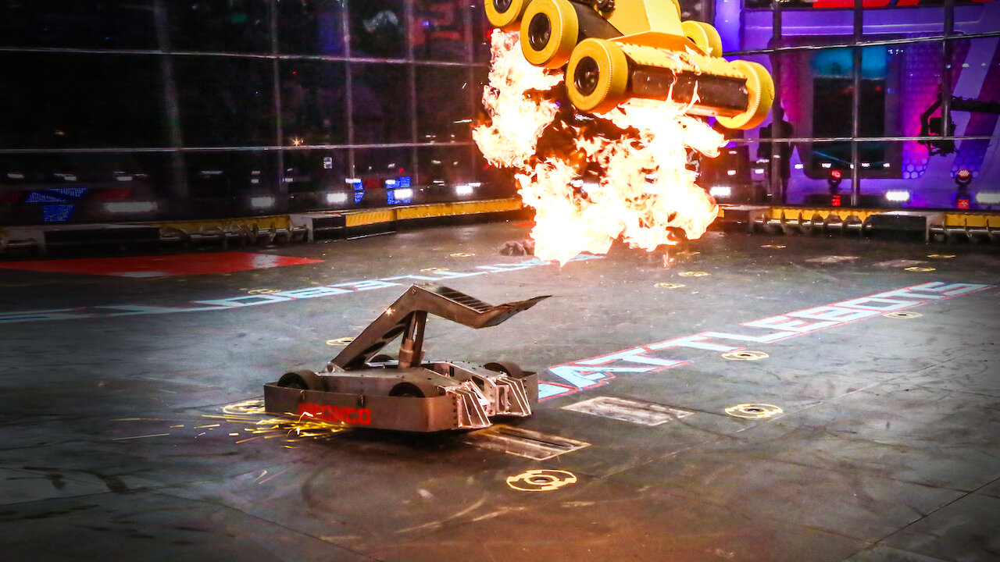

# Battle Bots, Roll Out!

  
## Project Description:
A data-driven project that focuses on unlocking Battlebot Tournament predictions through the power of Machine Learning and data analysis. By evaluating their match performance, we craft an accurate model to anticipate competition outcomes. With the prediction model, we look to enrich fans' experiences by empowering them to foresee tournament winners. 

## Project Goals:

## Executive Summary:

## Initial Hypothesis:

## Project Plan:

* **Acquire the data:** 
  * Web scraping was used to acquire the data
  * The data is from www.battlebots.com.

* **Prepare data for exploration:**
    * Observations that had special characters were removed from analysis
        - special characters (`%`, `-`)
        
    * Initial rows per season:
        - World Championship VII: 
        - Season 2021/2022: 
        - Season 2020:
        - Season 2019:
        
        
* **Separate into `train`, `validate`, and `test` datasets**
 
* **Explore data to develop an understanding of what features affect a robot's chances at winning.**
   * Initial questions:
       
       
* **Prepare the data for modeling:**
    
      
* **Develop a model to predict if a robot will win or lose.
   * Classification models were used to predict a robot's chance to win
       * Decision Tree
       * Random Forest
       * K Nearest Neighbor
       * Logistic Regression
       * XGBoost
   * Evaluate models on train and validate data**
   * Select the best model without overfitting. 
   

## Data Dictionary:

| **Feature** | **Definition** |
|:--------|:-----------|
| robot_name | name of robot |
| total_matches | total number of matches |
| win_percentage | percent of matches won |
| total_wins | total wins |
| losses | number of losses |
| ko | number of knockouts |
| ko_percentage | percentage of knockouts for matches |
| avg_ko_time | average time taken to knock an opponent out  |
| ko_against | opponent that got knockedout  |
| ko_against_percentage | percentage of knockout wins |
| decision_wins | number of wins by judges' decision |

## Steps to Reproduce
1. Clone this repo
2. Use the function from wrangle.py to scrape the data from the battlebots website 
    * May take a few hours to web scrape.
3. Use the functions from prepare.py to prepare the data for exploration
4. Run the explore and modeling notebook
5. Run final report notebook

